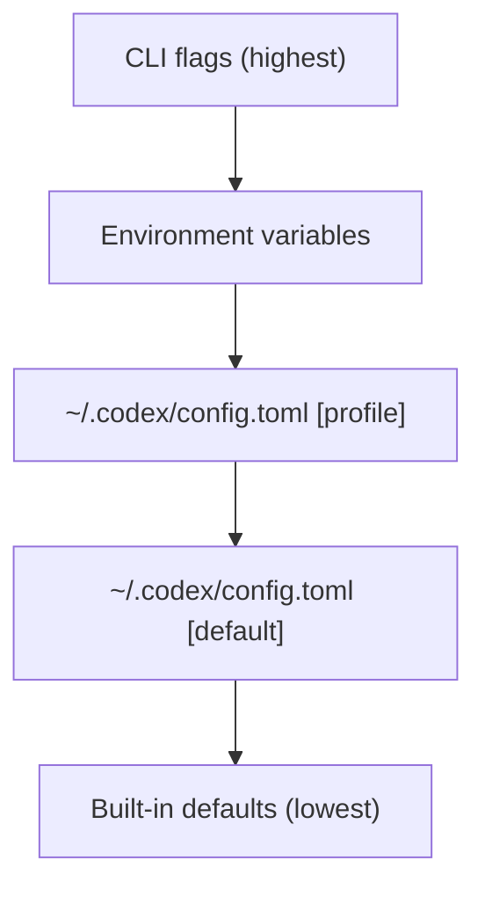

# Advanced Settings & Experimental Tweaks

Deep configuration techniques sourced from research and community best practices. For basic setup, see [Getting Started](./getting-started.md).

## Configuration Hierarchy

Codex CLI uses a TOML-based configuration system with profile support:



| Layer | File | Scope |
|---|---|---|
| **Config** | `~/.codex/config.toml` | Global settings + named profiles |
| **Instructions** | `AGENTS.md` (project root) | Per-project identity and rules |
| **Exec Policy** | `~/.codex/config.toml [exec_policy]` | Command-level allow/deny/prompt |
| **Memories** | `persistent-memory.json` | Agent-managed persistent context |

## config.toml — Multi-Profile Setup

### Safe Profile (Untrusted Projects)

```toml
[profiles.safe]
model = "gpt-5.3-codex"
approval_policy = "on-request"
sandbox = "read-only"
web_search = "disabled"

[profiles.safe.features]
web_search_request = false
```

### Balanced Profile (Trusted Projects)

```toml
[profiles.balanced]
model = "gpt-5.3-codex"
approval_policy = "on-request"
sandbox = "workspace-write"
web_search = "live"

[profiles.balanced.features]
web_search_request = true

[profiles.balanced.tui]
theme = "One Dark"
alternate_screen = true
```

### Full-Auto Profile (CI/CD)

```toml
[profiles.auto]
model = "gpt-5.3-codex"
approval_policy = "never"
sandbox = "workspace-write"

[profiles.auto.features]
web_search_request = true
```

Switch profiles:

```bash
codex --profile safe           # Untrusted environment
codex --profile balanced       # Daily development
codex --full-auto              # Shortcut for on-request + workspace-write
codex --yolo                   # No approvals, no sandbox (⚠️)
```

## AGENTS.md — Project Identity

### Advanced Template

```markdown
# AGENTS.md

## Identity
You are a senior Python engineer working on a large Django monolith.

## Stack
- Python 3.12, Django 5.0, Celery, Redis
- PostgreSQL 16 with PostGIS
- pytest, mypy (strict), ruff, black

## Conventions
- All views use class-based views (CBVs)
- Serialization via Django REST Framework
- Background tasks via Celery with explicit retries
- Migrations: `./manage.py makemigrations && ./manage.py migrate`

## Quality Gates
- All PRs must pass `pytest --cov=90`
- Type checking: `mypy . --strict`
- Linting: `ruff check .`

## Security
- Never hardcode secrets — use django-environ
- All user inputs sanitized via DRF serializers
- CSRF protection must remain enabled
```

> [!TIP]
> AGENTS.md supports markdown headers for organization. The agent reads the full file at session start.

## Exec Policy — Command-Level Control

### Fine-Grained Command Rules

```toml
[[exec_policy.rules]]
description = "Allow safe read commands"
action = "allow"
command_prefix = "git status"

[[exec_policy.rules]]
description = "Allow test execution"
action = "allow"
command_prefix = "pytest"

[[exec_policy.rules]]
description = "Block destructive operations"
action = "deny"
command_prefix = "rm -rf"

[[exec_policy.rules]]
description = "Block force push"
action = "deny"
command_prefix = "git push --force"

[[exec_policy.rules]]
description = "Prompt for package installs"
action = "prompt"
command_regex = "^(pip|npm|cargo) install"

[[exec_policy.rules]]
description = "Block piped shell execution"
action = "deny"
command_regex = "curl.*\\|.*sh"
```

### Sandbox Modes

| Mode | Flag | Behavior |
|---|---|---|
| **Read-only** | `--sandbox read-only` | Can read but not write files |
| **Workspace-write** | `--sandbox workspace-write` | Can write in project dir only |
| **Full access** | `--sandbox danger-full-access` | Unrestricted (⚠️) |

> [!WARNING]
> `danger-full-access` disables filesystem restrictions entirely. Only use in containers or disposable VMs.

## MCP Server Configuration

### Adding Custom MCP Servers

```toml
[mcp_servers.context7]
command = "npx"
args = ["-y", "@upstash/context7-mcp"]

[mcp_servers.dataagent]
command = "python"
args = ["-m", "dataagent_mcp"]
env = { DATABASE_URL = "postgresql://localhost/mydb" }
trust = true

[mcp_servers.custom_api]
type = "http"
url = "http://localhost:8080/mcp"
rmcp_client = true
```

### MCP Trust Model

| Setting | Behavior |
|---|---|
| `trust = true` | Tools execute without confirmation |
| `trust = false` (default) | Each tool call prompts for approval |

Verify connections:

```text
/mcp list              # Shows all servers and connection status
/tools                 # Shows all available tools including MCP tools
/tools desc            # Shows tool descriptions
```

## Persistent Memory (Experimental)

### How Memories Work

Codex maintains `persistent-memory.json` with learned patterns:

```json
{
  "memories": [
    {
      "content": "This project uses pytest with fixtures in conftest.py",
      "usage_count": 12,
      "created": "2026-02-15T10:00:00Z"
    }
  ]
}
```

### Memory Commands

```text
/mem add "Always run ruff check before committing"
/mem list              # Show all memories
/mem forget            # Remove a specific memory
```

> [!NOTE]
> As of CLI 0.106.0, memories use diff-based forgetting and usage-aware selection — inactive memories are automatically deprioritized.

## Multi-Agent Mode (Experimental)

### Agent Configuration

```toml
[agents]
enabled = true

[agents.config]
max_concurrent = 3
coordination = "hierarchical"
```

### Sub-Agent Nicknames (v0.106.0+)

```toml
[[agents.definitions]]
name = "test-writer"
model = "gpt-5.3-codex"
instructions = "You only write tests. Never modify source code."

[[agents.definitions]]
name = "security-reviewer"
model = "gpt-5.3-codex"
instructions = "Review all changes for OWASP Top 10 vulnerabilities."
```

### Agent Jobs (CSV-Based Parallelism)

Spawn multiple agents from a CSV of tasks:

```text
# In the TUI:
spawn_agents_on_csv tasks.csv
```

Where `tasks.csv`:
```csv
task,instructions
auth-module,"Build the JWT authentication module"
user-service,"Implement user CRUD with validation"
api-tests,"Write integration tests for all endpoints"
```

## Experimental Features

### js_repl (v0.106.0 — /experimental)

Interactive JavaScript REPL inside Codex for data exploration:

- Minimum Node 22.22.0
- Startup compatibility checks with user-visible warnings
- Supports `view_image` for visual outputs

### Voice Transcription (v0.105.0)

Speech-to-text input for hands-free coding sessions.

### Request User Input in Default Mode (v0.106.0)

Codex can now ask clarifying questions in Default mode (previously Plan-only):

```toml
[features]
request_user_input = true
```

### /clear and /copy (v0.105.0)

```text
/clear           # Clear terminal (Ctrl+L clears without new chat)
/copy            # Copy last output to clipboard
```

### Theme-Aware Diff Backgrounds (v0.105.0)

Adaptive diff coloring based on terminal capabilities and selected theme.

## Performance Tuning

### Context Window Strategy

- Keep AGENTS.md under 2000 tokens
- Use `/compact` to summarize long conversations
- Delegate large sub-tasks to fresh agents (each gets full context window)

### Monitoring

```text
/status          # Model, policy, sandbox, features summary
/model           # Switch models or adjust reasoning
/review          # Code review presets
```

### Writable Roots

Check what directories Codex can modify:

```bash
codex --sandbox workspace-write --add-dir /path/to/extra/dir
```

`--add-dir` grants write access to additional directories beyond the project root.

## See Also

- [Features](./features.md) — Core features overview
- [Commands](./commands.md) — CLI reference
- [Integrations](./integrations.md) — Platform interfaces and third-party tools
- [Official Links](./official-links.md) — All official sources
