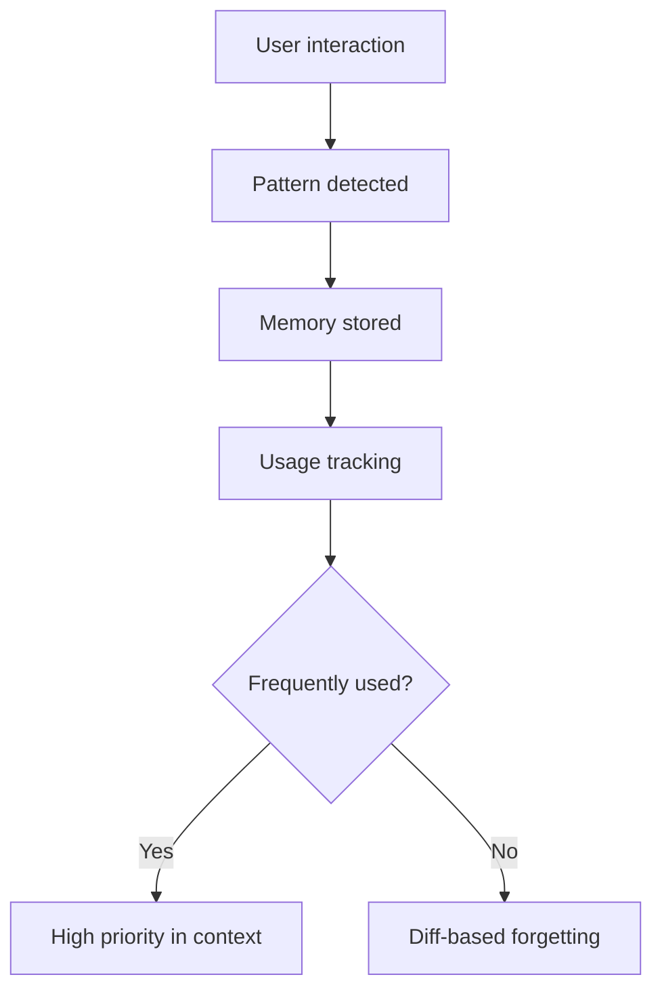

# Experimental Settings & Research-Based Tweaks

> [!WARNING]
> These techniques are sourced from deep research, community experiments, and cutting-edge patterns. They may change, break, or require specific versions. Use at your own risk.

## Persistent Memory System (v0.106.0)

### How Memories Work

Codex maintains a `persistent-memory.json` file that stores learned patterns across sessions:



### Memory Management Commands

```text
/mem add "This project uses pytest with conftest.py fixtures"
/mem add "Always run ruff check before committing"
/mem add "Database migrations use alembic with autogenerate"
/mem list                    # Show all memories with usage stats
/mem forget                  # Remove a specific memory
```

### Usage-Aware Selection (v0.106.0)

Memories are ranked by usage frequency. Inactive memories get deprioritized:

| Memory Age | Usage Count | Priority |
|---|---|---|
| < 7 days | Any | High |
| 7-30 days | > 5 uses | Medium |
| 7-30 days | < 5 uses | Low |
| > 30 days | < 3 uses | Eligible for forgetting |

### Diff-Based Forgetting (v0.106.0)

When memory capacity is reached, Codex compares overlapping memories and merges them:

```
"Always use pytest" + "Run pytest with --cov flag"
→ Merged: "Always use pytest with --cov flag"
```

## Multi-Agent System (Experimental)

### Agent Configuration

```toml
# ~/.codex/config.toml

[agents]
enabled = true
max_concurrent = 4
coordination = "hierarchical"

[[agents.definitions]]
name = "architect"
model = "gpt-5.3-codex"
instructions = """
Plan implementation approach. Output ONLY:
1. Component breakdown
2. Interface definitions
3. Dependency graph
NEVER write implementation code.
"""

[[agents.definitions]]  
name = "implementer"
model = "gpt-5.3-codex"
instructions = "Implement code matching the architect's spec exactly."

[[agents.definitions]]
name = "tester"
model = "gpt-5.3-codex"
instructions = "Write comprehensive tests. Never modify source code."

[[agents.definitions]]
name = "reviewer"
model = "gpt-5.3-codex"
instructions = "Security and quality review. Output severity-rated findings only."
```

### Agent Jobs — CSV Parallelism (v0.105.0)

Spawn multiple agents from a task list:

```text
# In TUI:
spawn_agents_on_csv tasks.csv
```

```csv
task,instructions,model
auth-module,"Build JWT auth with refresh tokens",gpt-5.3-codex
user-crud,"Implement user CRUD with validation",gpt-5.3-codex
api-tests,"Write integration tests for all endpoints",gpt-5.3-codex
```

Progress UI shows real-time status of all spawned agents.

### Sub-Agent Nicknames (v0.106.0)

Name sub-agents for easier tracking:

```text
/agent spawn --name "auth-builder" "Build the authentication module"
/agent spawn --name "test-writer" "Write tests for auth module"
```

### Pending Child-Thread Approvals (v0.105.0)

Parent agent sees approval requests from child agents in the TUI:

```
┌─ auth-builder ─────────────────────┐
│ Needs approval: Run `npm test`     │
│ [Approve] [Deny]                   │
└────────────────────────────────────┘
```

## js_repl — Interactive JavaScript Runtime (v0.106.0)

### Setup

Promoted from hidden to `/experimental`:

```toml
[features]
js_repl = true
```

**Requirements:**
- Node.js ≥ 22.22.0
- Startup compatibility checks run automatically

### Capabilities

- Execute JavaScript inline during coding sessions
- Data exploration and transformation
- `view_image` support for visual outputs
- Kernel error surfacing with clean reset

### Usage

```text
# In the TUI, Codex uses js_repl transparently for:
- Quick calculations
- JSON data manipulation
- API response parsing
- Chart/diagram generation via view_image
```

## Voice Transcription (v0.105.0)

Speech-to-text input for hands-free coding:

```toml
[features]
voice_input = true
```

Use voice to describe changes, ask questions, or provide feedback while keeping hands on the keyboard.

## Exec Policy — Advanced Patterns

### Regex-Based Command Matching

```toml
[[exec_policy.rules]]
description = "Block piped shell execution"
action = "deny"
command_regex = "curl.*\\|.*(sh|bash)"

[[exec_policy.rules]]
description = "Allow specific pytest patterns"
action = "allow"
command_regex = "^pytest\\s+(--cov|--verbose|-x|-v)"

[[exec_policy.rules]]
description = "Prompt for any database mutation"
action = "prompt"
command_regex = "(DROP|DELETE|ALTER|TRUNCATE)"
```

### Priority System

Higher priority numbers win when rules conflict:

| Rule | Priority | Effect |
|---|---|---|
| Default allows | 1 | Baseline |
| Project denies | 50 | Override defaults |
| Security blocks | 100 | Override everything |
| YOLO override | 999 | Built-in, bypass all |

> [!CAUTION]
> `--yolo` uses priority 999, overriding ALL custom rules. Never use in production.

## Request User Input in Default Mode (v0.106.0)

Previously Plan-mode only — Codex can now ask clarifying questions in Default mode:

```toml
[features]
request_user_input = true
```

When enabled, Codex will pause to ask:
- Which of several approaches to take
- Clarification on ambiguous requirements
- Confirmation before large-scale changes

## Advanced TUI Features

### /clear and /copy (v0.105.0)

```text
/clear           # Clear terminal + start new chat
Ctrl+L           # Clear terminal only (keep chat)
/copy            # Copy last response to clipboard
```

### Thread Search (v0.105.0)

```text
codex resume --search "auth"    # Find sessions by keyword
```

### Theme-Aware Diff Backgrounds (v0.105.0)

Adaptive diff coloring with capability-graded palettes:
- 256-color terminals get gradient-based backgrounds
- 16-color terminals get ANSI-safe highlighting
- Custom themes via `.tmTheme` files in `$CODEX_HOME/themes/`

### /compact (Context Compression)

```text
/compact         # Summarize conversation history to free context
```

After compaction, `/status` shows freed context. Use proactively before complex sub-tasks.

## App-Server v2 API (v0.106.0)

### Thread-Scoped Realtime Endpoints

```
POST /api/v2/threads/{id}/realtime    # Connect to thread events
DELETE /api/v2/threads/{id}/subscribe # Unload without archiving
```

### WebSocket v2 Protocol

Codex now prefers WebSocket v2 when supported by the model:
- Automatic retry on HTTP 400 handshake timeout
- Incremental connection support (don't resend output items)
- `permessage-deflate` extension compatibility

## Direct Install (v0.106.0)

Skip npm — install Codex directly on macOS/Linux:

```bash
curl -fsSL https://github.com/openai/codex/releases/latest/download/install.sh | sh
```

The install script bundles the `codex` binary and `rg` (ripgrep).

## Performance Profiling

### Context Window Strategy

| Context Section | Token Budget | Purpose |
|---|---|---|
| AGENTS.md | 2,000 max | Project identity |
| Active files | 5,000 max | Current work |
| Memories | 1,000 max | Learned patterns |
| Conversation | Remaining | Dialogue history |

### Monitoring Dashboard

```text
/status          # Full session summary
/model           # Current model + reasoning level
/review          # Code review presets
```

### Agent Efficiency Metrics

| Metric | Healthy | Concern |
|---|---|---|
| Turns per task | 5-15 | > 20 = drift |
| File reads/turn | 1-3 | > 5 = thrashing |
| Memory usage | < 50 items | > 100 = prune needed |
| Exec policy blocks | < 5% | > 20% = rules too strict |

## See Also

- [Advanced Settings](./advanced-settings.md) — Production-ready configuration
- [Features](./features.md) — Core features
- [Commands](./commands.md) — CLI reference
- [Changelog](./changelog.md) — Full release history
