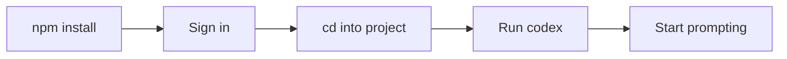

# Getting Started with OpenAI Codex

Codex is OpenAI's coding agent available as a native app, IDE extension, CLI, and cloud platform. It reads, edits, and runs code in your project directory. Codex is included with ChatGPT Plus, Pro, Business, Edu, and Enterprise plans.

> [!NOTE]
> Codex CLI is [open source](https://github.com/openai/codex) and built in Rust for speed and efficiency.

## Prerequisites

- A **ChatGPT subscription** (Plus, Pro, Business, Edu, or Enterprise) or an **OpenAI API key**.
- **npm** installed for CLI installation.

## Installation

```bash
npm i -g @openai/codex
```

> [!IMPORTANT]
> Codex CLI is available on macOS and Linux. Windows support is experimental — for the best experience, use Codex in a WSL workspace. See the [Windows setup guide](https://developers.openai.com/codex/windows).

## Authentication

```bash
codex
```

The first time you run Codex, you'll be prompted to sign in. Authenticate with your **ChatGPT account** or an **API key**.

## First Session



1. Open a terminal in your project:

   ```bash
   cd /path/to/your/project
   codex
   ```

2. Try some initial prompts:

   ```text
   Tell me about this project
   Build a classic Snake game in this repo.
   Find and fix bugs in my codebase with minimal, high-confidence changes.
   ```

> [!TIP]
> Need inspiration? Check out the [Explore section](https://developers.openai.com/codex/explore) for example prompts and use cases.

## Upgrade

```bash
npm i -g @openai/codex@latest
```

See the [Changelog](https://developers.openai.com/codex/changelog) for release notes.

## Available Interfaces

| Interface | Description | Link |
|---|---|---|
| **App** (macOS) | Native desktop application | [App Overview](https://developers.openai.com/codex/app) |
| **IDE Extension** | VS Code, Cursor, Windsurf | [IDE Overview](https://developers.openai.com/codex/ide) |
| **CLI** | Terminal-based agent | [CLI Overview](https://developers.openai.com/codex/cli) |
| **Cloud / Web** | Cloud-based environments | [Cloud Overview](https://developers.openai.com/codex/cloud) |

## What's Next?

- [Quickstart](https://developers.openai.com/codex/quickstart) — Full setup across App, IDE, CLI, and Cloud
- [CLI Features](https://developers.openai.com/codex/cli/features) — Interactive mode, multi-agent, code review, web search
- [Configuration](https://developers.openai.com/codex/config-basic) — Config file, rules, AGENTS.md, MCP, skills
- [CLI Reference](./commands.md) — Complete command-line options and flags
