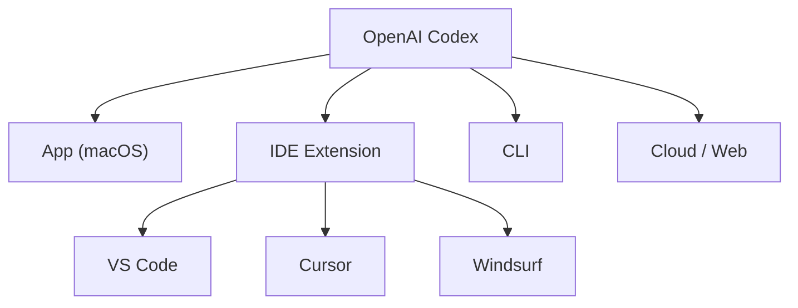

# Integrations & Environments

Codex is available across multiple platforms and integrates with popular third-party services.

## Platform Interfaces

### App (macOS)

The native desktop app provides a graphical interface for local coding sessions with full access to Codex features.

- [App Overview](https://developers.openai.com/codex/app)
- [App Features](https://developers.openai.com/codex/app/features)
- [App Settings](https://developers.openai.com/codex/app/settings)
- [Automations](https://developers.openai.com/codex/app/automations)
- [Worktrees](https://developers.openai.com/codex/app/worktrees)
- [Local Environments](https://developers.openai.com/codex/app/local-environments)
- [Troubleshooting](https://developers.openai.com/codex/app/troubleshooting)

### IDE Extension

Install the Codex extension in your editor:

- [VS Code](vscode:extension/openai.chatgpt)
- [Cursor](cursor:extension/openai.chatgpt)
- [Windsurf](windsurf:extension/openai.chatgpt)

See: [IDE Overview](https://developers.openai.com/codex/ide) · [IDE Features](https://developers.openai.com/codex/ide/features) · [IDE Commands](https://developers.openai.com/codex/ide/commands)

### Cloud / Web

Run tasks in cloud-hosted environments without a local workspace:

- [Cloud Overview](https://developers.openai.com/codex/cloud)
- [Cloud Environments](https://developers.openai.com/codex/cloud/environments)
- [Internet Access](https://developers.openai.com/codex/cloud/internet-access)

## Third-Party Integrations

| Integration | Description | Link |
|---|---|---|
| **GitHub** | Code hosting, PRs, automation | [Docs](https://developers.openai.com/codex/integrations/github) |
| **Slack** | Team messaging integration | [Docs](https://developers.openai.com/codex/integrations/slack) |
| **Linear** | Issue tracking integration | [Docs](https://developers.openai.com/codex/integrations/linear) |

## Automation

| Feature | Description | Link |
|---|---|---|
| Non-Interactive Mode | Scripted / CI runs | [Docs](https://developers.openai.com/codex/noninteractive) |
| Codex SDK | Programmatic access | [Docs](https://developers.openai.com/codex/sdk) |
| App Server | Local server for app | [Docs](https://developers.openai.com/codex/app-server) |
| GitHub Action | CI/CD automation | [Docs](https://developers.openai.com/codex/github-action) |
