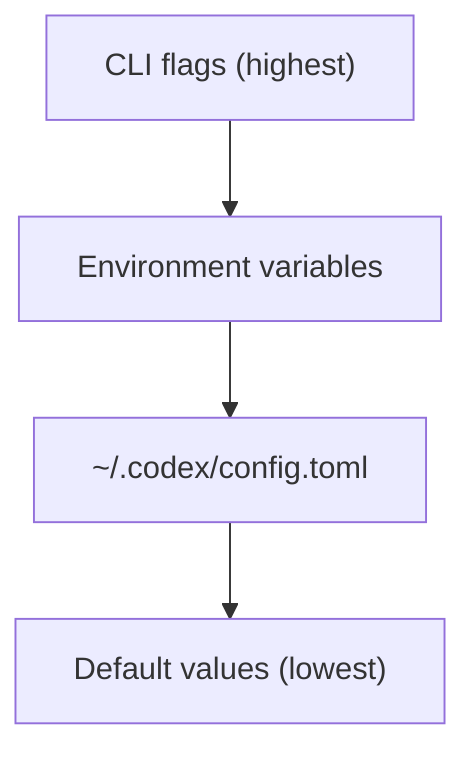

# Configuration & Customization

Codex CLI uses a layered TOML-based configuration system. CLI flags override file settings for each invocation.

## Configuration Files

Settings are read from `~/.codex/config.toml`. Use `--profile` to load named profiles within that file.

```toml
# ~/.codex/config.toml

model = "gpt-5.3-codex"
web_search = "cached"

[sandbox]
mode = "workspace-write"

[tui]
theme = "One Dark"
alternate_screen = true
```

See [Config Reference](https://developers.openai.com/codex/config-reference) for all available keys and a [Sample Config](https://developers.openai.com/codex/config-sample).

## Configuration Precedence



## AGENTS.md

`AGENTS.md` is the project-level identity and instruction file for Codex — similar to Claude's `CLAUDE.md`. Place it in your repository root to provide persistent context:

```markdown
# AGENTS.md
You are working on a TypeScript monorepo with React frontend and Express backend.
Always use TypeScript strict mode and include JSDoc comments.
```

See [AGENTS.md Guide](https://developers.openai.com/codex/guides/agents-md).

## Rules

Rules define specific behaviors and constraints for Codex. See [Rules](https://developers.openai.com/codex/rules).

## MCP (Model Context Protocol)

Add third-party tools and context sources:

```bash
codex mcp                   # Manage MCP servers
codex mcp-server            # Run Codex itself as an MCP server
```

See [MCP Configuration](https://developers.openai.com/codex/mcp).

## Skills

Skills are reusable task templates. Configure via the `[skills]` section in `config.toml`. See [Skills](https://developers.openai.com/codex/skills).

## Multi-Agent Configuration

Configure multi-agent workflows via the `[agents]` section in `config.toml`. See [Multi-Agent](https://developers.openai.com/codex/multi-agent).

## Prompting Best Practices

For effective results with Codex:

- **Be specific** — Include filenames, expected behavior, and constraints.
- **Use AGENTS.md** — Set project-level context once, reuse across sessions.
- **Break complex tasks into steps** — Multi-step instructions yield better results.
- **Use Cloud for long-running tasks** — Offload large refactors to Codex Cloud.

See the [Codex Prompting Guide](https://developers.openai.com/codex/prompting) for detailed strategies.

## See Also

- [Config Basics](https://developers.openai.com/codex/config-basic)
- [Advanced Config](https://developers.openai.com/codex/config-advanced)
- [Security](https://developers.openai.com/codex/security)
- [Enterprise Administration](https://developers.openai.com/codex/enterprise/admin-setup)
